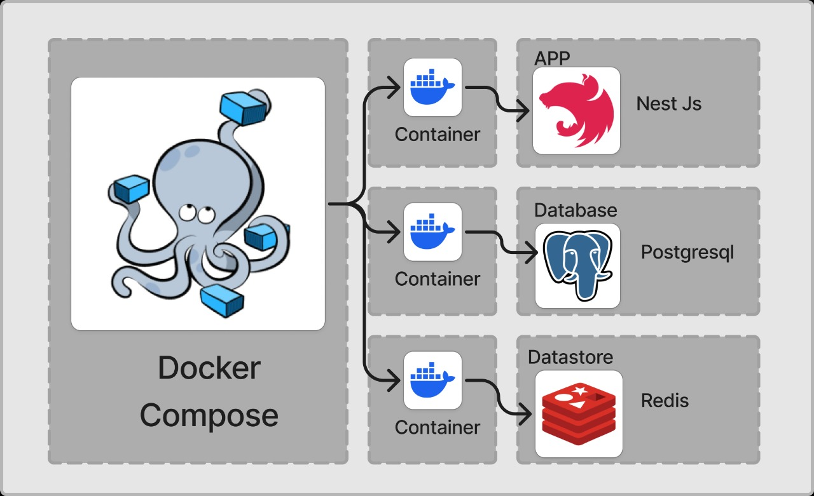
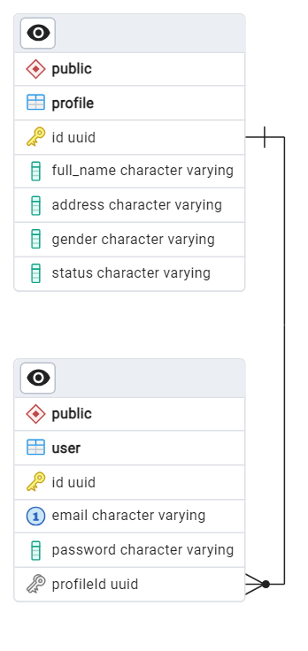

<h1 align="center">Nongki Project</h1>

## Arsitektur
<p align="center">
  
</p>

## ERD (Entity Relationship Diagram)
<p align="center">
  
</p>

## Daftar Fitur

1. **Register**
2. **Login (JWT)**
3. **Logout (JWT)**
4. **Add Profile**
5. **Update Profil**
6. **Delete Pengguna**
7. **Get All User**

## Instalasi

1. Clone repository:
   ```bash
   git clone https://github.com/Arcaz22/nongki_test.git
2. Copy the .env configuration file and fill it in:
   ```bash
   cp .env.example .env
   ```
3. Run app(docker):
   ```bash
   docker-compose up --build -d
   ```
4. Thank You
